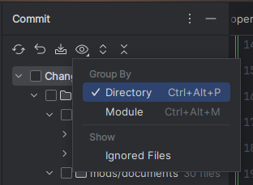

# COMMIT CONVENTION
Based version: https://www.conventionalcommits.org/en/v1.0.0/.
Commit message must satisfy rules in the conventional commit v1.0.0.

# ADDITIONS!
- **Commit Expression**:

  - **COMMIT WITHOUT SIDE EFFECT**:
  
    **Expression**:
    ```
    `type`(`scope`): `message`.
    ```
    **Example**:
    ```
    feat(login): init.
    ```
  - **COMMIT WITH SIDE EFFECTS**:
    if commit contains scope violation changes, you need to add ! (exclamation mark) in front of commit message, to inform others that your commits had scope violation.
  
    **Expression**:
    ```
    !`type`(`scope`): `message`.
    ALSO:
      - `effect 1`.
      - `effect 2`.
    ```
    **Example**:
    ```
    !feat(account): local cache.
    ALSO:
      - remove seat belt.
      - change the nuclear button with smile emoji.
    ```
- **Accepted types**: `feat`, `proj-feat`(for project feature), `fix`, `proj-fix`(for project bug), `BREAKING CHANGE`, `proj-BREAKING CHANGE`(for project changes), `docs`
- **One sentence message**. Message can only contain 1 sentence or phrase.
- **Commit Contains Side Effects**. If for some reason a commit has side effects, or in the same commit you are doing something out of the scope that you are working on,
  you must add `ALSO` footer and put `!` (exclamation mark) in front. 
  example:

  - NO SIDE EFFECT
    ```
    feat(login): init.
    ```
    ```
    fix(login): button state not changing properly.
    ```
    ```
    BREAKING CHANGE: move module `account` to `lib/old/account`.
    ```
  - WITH SIDE EFFECT
    ```
    !feat(cart): local caching.
    ALSO:
      - refactor: remove database v1 instance
      - refactor: change database instance v1 to v2
    ```
    ```
    !proj-BREAKING CHANGE: move module `account` to `lib/old/account`.
    ALSO:
      - delete unused module
    ```
    
# COMMIT STRATEGY
- **Prefers directory based**. Since now directory represent layers, we prefer committing changes by directories.

  

- **Additions commit must be the lowest layer fist**; Means that if you are adding something and prefer committing changes one by one, you must start from the lowest layer first.
- **Deletions commit must be the highest layer first**; Means that if you are deleting something and prefer committing changes one by one, you must start from the highest layer first.
- **Additions first**. Means that if your commit contains both Additions and Deletions, you must commit the additions first and follow the additions rules, only then you can commit the deletions or other changes.
- **Whole Commit**. If you prefer committing whole changes at once, you are allowed. But you must pay attentions to the side effects and follow the rules for commit contains side effects.

DESIGNED By: [Stefanus Ayudha Junior](https://www.linkedin.com/in/stefanus-ayudha-447a98b5/)<br>
mailto: [stefanus.ayudha@gmail.com](mailto:stefanus.ayudha@gmail.com)
